# 10w条牌谱数据存储方案

## 需求分析

结合每日 10w 条牌谱数据和 Wizard 当前练习场的交互方案，考虑一下如何设计存储方案。

Wizard 当前练习场的交互方案是：

- 用户可以选择按照 session 查看牌谱数据。
- session 点击可以进入查看对应的 hand history 数据。
- 点击 hand history 数据，可以进入查看对应的牌谱数据。
- 支持 session 收藏、 hand history 收藏。
- 默认按照时间排序，取近 100 条数据。
- 支持多维度搜索 hand history 数据。(注： 时间搜索没有范围限制)

进一步分析 Wizard 的实现，可以得到以下信息：

1. 拥有实体 User、 Session 、Hand History。

- 一个 User 包含多个 Session。
- 一个 Session 包含多个 Hand History。
- 一个 Hand History 包含一个牌谱数据。
- 一个 User 可以拥有多个收藏的 Session 和 Hand History。(这里的收藏不是单独的实体，是 Session 和 Hand History 的字段)
- 一个 User 可以拥有多个牌谱数据。

2. 数据量分析

- Session 可能存在多条记录，单条记录不大。
- Hand History 的记录量远远大于 Session 的记录量。且如果存储了牌谱数据就会很大。

因此我们提到的 10w 条牌谱数据，主要是指 Hand History 的记录量。

做一个数据量预估，假设每天 `10w` 条牌谱数据，单条数据 `5KB`，那么每天的数据量大约是 `500MB`。

一个月 `300w` 条牌谱数据，大约占用 `15GB` 空间。

## 实践方案

### 牌谱数据过大问题

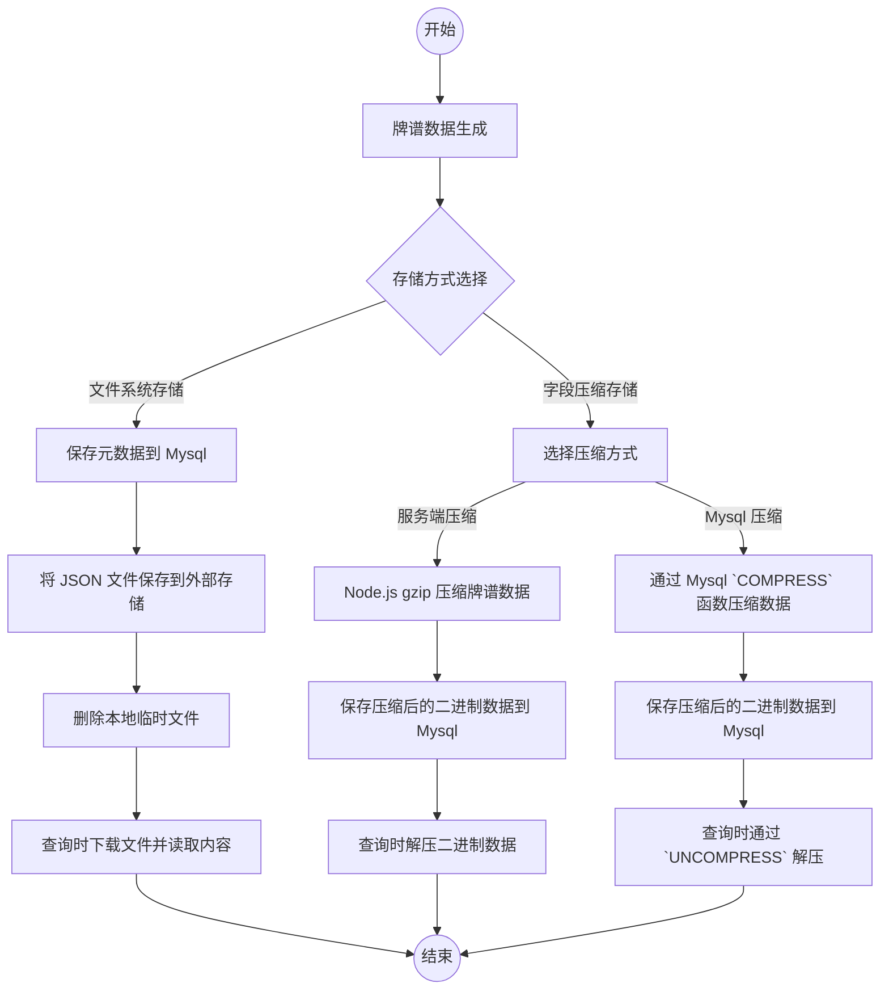

#### 文件系统存储

Mysql 存元数据，牌谱的 JSON 文件直接存储至外部存储。

**保存代码示例**

```ts
async function uploadToS3(handRecordJson: string) {
  // 文件落到本地
  let filepath = './temp/xxx/xxx.json'
  fs.writeFileSync(filepath, handRecordJson)

  // 上传文件到外部存储
  await s3.uploadFile(filepath) // 这里没实际调研 S3 的API，如果支持传入 stream 可能就不需要额外一次 IO 操作了。

  // 删除本地文件
  fs.unlinkSync(filepath)
  return filepath
}

// 保存牌谱历史
async function saveHandHistory(handHistory: HandHistory) {
  // 上传文件到外部存储
  const filepath = await uploadToS3(handHistory.handRecordJson) // s3://bucket/YYYY-MM/user_id/xxx.json

  // 保存元数据
  return await mysql.insert({
    user_id: handHistory.user_id,
    session_id: handHistory.session_id,
    filepath: filepath,
    created_at: new Date(),
    updated_at: new Date(),
  })
}
```

**读取代码示例**

```ts
async function getHandHistory(handHistoryId: string) {
  // 查询元数据
  const [[row]] = await mysql.query('SELECT * FROM hand_history WHERE id = ?', [handHistoryId])

  // 下载文件
  const filepath = row.filepath
  const handRecordJson = await downloadFromS3(filepath)
  row.handRecordJson = handRecordJson

  return row
}
```

这种方式虽然会减少单条数据的存储空间，但是会导致查询效率降低。

且会导致外部存储存在很多小文件，难以管理。所以这种方案不适合长期存储。

#### 字段压缩存储

字段可以分两个维度，一是业务上进行裁剪，保留最小的信息元素。这里不做讨论。

二是技术层面的压缩。主要分为服务端压缩、数据库压缩两种方式。

**服务端压缩示例**

```ts
import { promisify } from 'util'
import { gzip, gunzip } from 'zlib'
const gzipAsync = promisify(gzip)
const gunzipAsync = promisify(gunzip)

// Node.js 端 gzip 压缩
async function compressText(text: string): Promise<Buffer> {
  return gzipAsync(text)
}

// 解压
async function decompressText(blob: Buffer): Promise<string> {
  const decompressed = await gunzipAsync(blob)
  return decompressed.toString('utf8')
}

// 存储数据
async function saveHandHistory(handHistory: HandHistory) {
  // 服务端压缩牌谱数据
  let compressedText = await compressText(JSON.stringify(handHistory.handRecordJson))

  // 保存元数据
  return await mysql.insert({
    user_id: handHistory.user_id,
    session_id: handHistory.session_id,
    handRecordBlob: compressedText, // 二进制数据
    created_at: new Date(),
    updated_at: new Date(),
  })
}

// 读取数据
async function getHandHistory(handHistoryId: string) {
  // 查询元数据
  const [[row]] = await mysql.query('SELECT * FROM hand_history WHERE id = ?', [handHistoryId])

  // 解压缩、转码
  const blob = row.handRecordBlob // 二进制数据
  const handRecordJson = await decompressText(blob)
  row.handRecordJson = handRecordJson

  return row
}
```

**Mysql压缩示例**

```ts
// 存储数据
async function saveHandHistory(handHistory: HandHistory) {
  // 保存元数据， 通过 Mysql 的 COMPRESS() 函数压缩
  return await mysql.insert({
    user_id: handHistory.user_id,
    session_id: handHistory.session_id,
    handRecordBlob: { sql: `COMPRESS(?)`, params: [JSON.stringify(handHistory.handRecordJson)] },
    created_at: new Date(),
    updated_at: new Date(),
  })
}

// 读取数据
async function getHandHistory(handHistoryId: string) {
  // 查询元数据，通过 Mysql 的 UNCOMPRESS() 函数解压
  const [[row]] = await mysql.query(
    'SELECT xxx, UNCOMPRESS(handRecordBlob) AS handRecordJson FROM hand_history WHERE id = ?',
    [handHistoryId]
  )

  return row
}
```

**总结**

实测压缩效果：

```json
// 源文件: 16KB, 字符长度: 10009, 压缩率: 88%
{
  "originalBlobSize": 10009, // 源文件字符长度
  "compressedBlobSize": 1224, // 压缩后文件字符长度
  "compressionRatio": "88%" // 压缩率
}
```

压缩效果挺好的，但存在的弊端是每次读写多一次 CPU 运算，查表的时候没办法很直观的看到源数据。

#### 结论

基于对比两种方案，我倾向使用**字段压缩存储**，不论是保留 JSON 格式，裁剪字段。

还是选择 Mysql 的压缩函数，都可以很好的解决字段过大占用存储空间的问题。

### 条数过多问题

针对每日数据量大导致单表数据过多的问题，首先想到的方案就是`分表`。

分表方案有很多，考虑到预估每月数据量 300w 左右，感觉可以按时间分表。

同时考虑到业务特性，查询牌谱是按照用户维度查询的，是不是可以按用户分表。

数据量大了是不是仍然需要冷热分离，因此需要从多个角度考虑。

关注的细节在于 拆分粒度、拆分策略、以及拆分后数据如何查询。

#### 按时间拆表

按时间拆表我们默认采用一月一次的策略，实际落地可以再调整。

这里先对比一下常见的两种分表方式：

|              | Mysql 分区表方案                                                                            | 应用层分表方案                                                                        |
| ------------ | ------------------------------------------------------------------------------------------- | ------------------------------------------------------------------------------------- |
| 核心思路     | 一个逻辑表，通过 Mysql PARTITION 分区表实现                                                 | 多个独立表（如 table_202501, table_202502）应用层决定写入哪个表                       |
| 优点         | 1. SQL简单，不需要改业务代码。</br> 2. 跨分区（时间）查询方便。                             | 1. 单表更小，DDL 操作影响更小。</br> 2. 方便迁移，多设备部署。</br> 3. 方便冷热分离   |
| 缺点         | 1. DDL 操作影响整张表。</br> 2. 写入性能无法提升                                            | 1. SQL 复杂度高，需要手动获取表名。</br> 2. 跨分区查询及其痛苦。</br> 3. ORM 支持过差 |
| 时间分区痛点 | 1. 都需要维护定期分区逻辑。</br> 2. 通过非时间选项查询，需要扫描全区。</br> 3. 跨表分页问题 |

##### Mysql 分区表方案

<a id="mysql-分区表方案-表结构示例"></a>

###### 表结构示例

```sql
CREATE TABLE `hand_history` (
  `id` int unsigned NOT NULL AUTO_INCREMENT,
  `user_id` int unsigned NOT NULL DEFAULT '0',
  `session_id` int unsigned NOT NULL DEFAULT '0',
  `hand_record_json` text NOT NULL,
  `created_at` bigint unsigned NOT NULL DEFAULT '0',
  `updated_at` bigint unsigned NOT NULL DEFAULT '0',
  PRIMARY KEY (`id`, `created_at`),
  KEY `idx_user_id` (`user_id`),
  KEY `idx_session_id` (`session_id`),
  KEY `idx_updated_at` (`updated_at`)
)
ENGINE=InnoDB
DEFAULT CHARSET=utf8mb4 COLLATE=utf8mb4_0900_ai_ci
ROW_FORMAT=DYNAMIC
PARTITION BY RANGE (`created_at`) (
    PARTITION p202510 VALUES LESS THAN (UNIX_TIMESTAMP('2025-11-01 00:00:00')),
    PARTITION p202511 VALUES LESS THAN (UNIX_TIMESTAMP('2025-12-01 00:00:00')),
    PARTITION p_future VALUES LESS THAN MAXVALUE
);

```

分区表要求分区键必须主键，因此需要将 `id` 和 `created_at` 作为联合主键。

~~Mysql 分区表要求分区键必须是`确定性`的表达式。~~

~~`timestamp` 类型作为一个可以随时区变化的字段值，会存在边界问题，不允许作为分区键。~~

~~示例中采用了 `bigint` 类型存储时间戳，直接使用时间戳进行分区。~~

`timestamp` 可以采用 `UNIX_TIMESTAMP()` 函数转换为 bigint 类型，作为分区键。

参考 [Mysql Doc - 26.2.1 RANGE Partitioning](https://dev.mysql.com/doc/refman/8.0/en/partitioning-range.html)

###### 流程图

**数据保存流程**

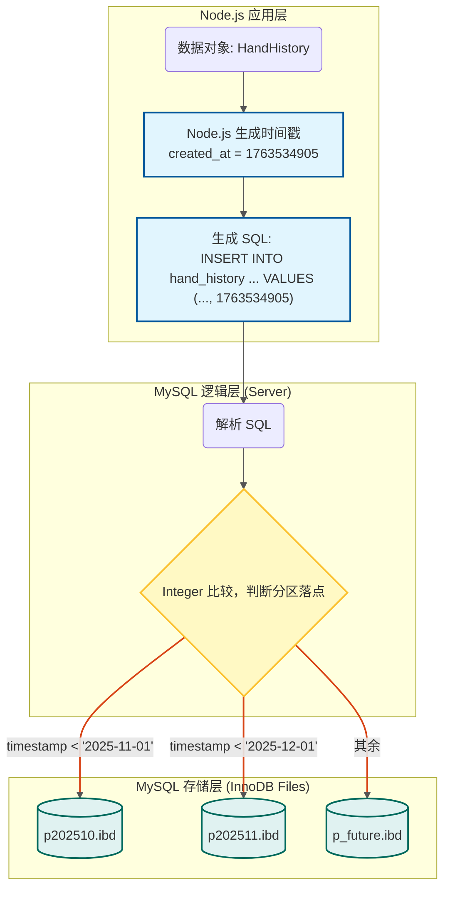

**查询数据流程**

1. 携带时间查询（分区字段）

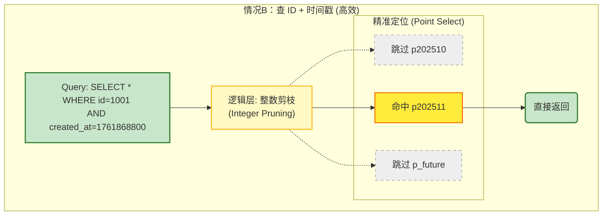

2. 不携带时间查询（非分区字段）

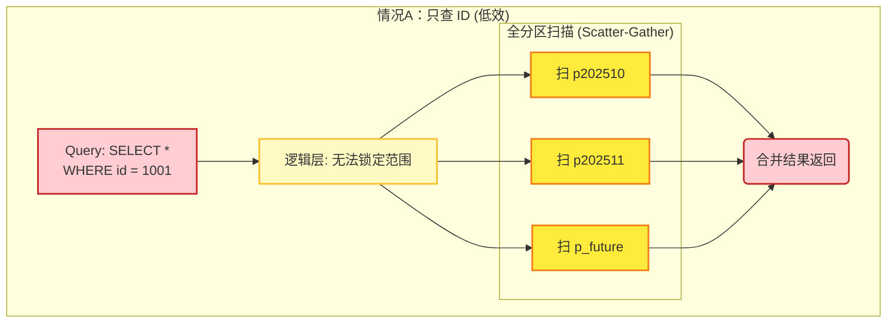

3. 跨分区分页查询

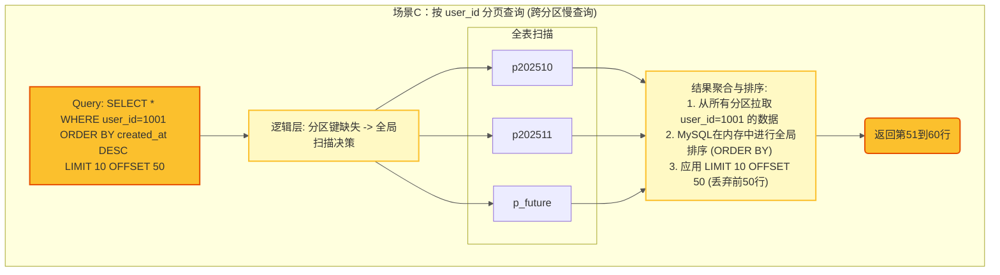

**定时维护分区方案**

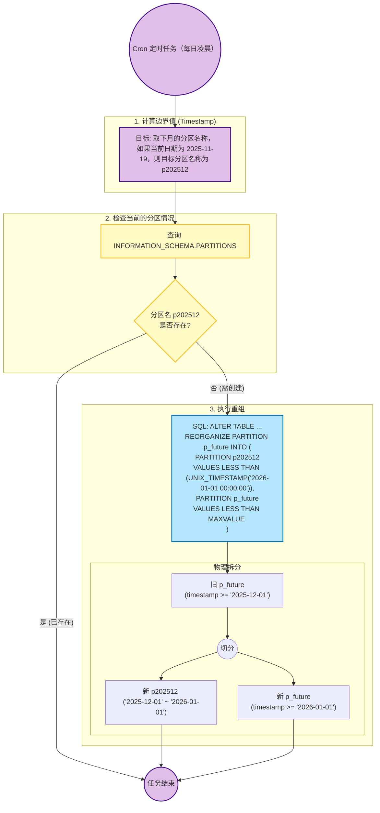

定期维护方案，采用 Nodejs 执行定时任务的策略，定期检查是否需要开辟新分区。

涉及到的 SQL：

```sql
-- 查询当前表的分区情况
SELECT PARTITION_NAME
FROM INFORMATION_SCHEMA.PARTITIONS
WHERE TABLE_SCHEMA = DATABASE()
  AND TABLE_NAME = 'hand_history';
-- result:
--| PARTITION_NAME |
--| p202510 |
--| p202511 |
--| p_future |


-- 重构分区，将 p_future 分区重构到 p202512 分区，并保留 p_future 分区。
ALTER TABLE hand_history REORGANIZE PARTITION p_future INTO (
    PARTITION p202512 VALUES LESS THAN (UNIX_TIMESTAMP('2026-01-01 00:00:00')),
    PARTITION p_future VALUES LESS THAN (MAXVALUE)
);

```

###### 伪代码示例

- Mysql 表 schema

参考 [**mysql-分区表方案-表结构示例**](#mysql-分区表方案-表结构示例)

- Node 示例

**保存代码示例**

保存、查询的时候分表对应用层完全透明。

```ts
// 保存牌谱历史
async function saveHandHistory(handHistory: HandHistory) {
  // 保存元数据
  return await mysql.insert({
    user_id: handHistory.user_id,
    session_id: handHistory.session_id,
    handRecordJson: handHistory.handRecordJson,
    created_at: dayjs().unix(),
    updated_at: dayjs().unix(),
  })
}
```

**查询代码示例**

```ts
// 根据ID查询牌谱历史
async function getHandHistory(handHistoryId: string) {
  // 查询元数据
  const [[row]] = await mysql.query('SELECT * FROM hand_history WHERE id = ?', [handHistoryId])
  return row
}

// 根据用户ID和时间范围查询牌谱历史
async function getHandHistoryByUserIdAndTimeRange(
  userId: string,
  startTime: string,
  endTime: string
) {
  // 查询元数据
  const [rows] = await mysql.query(
    'SELECT * FROM hand_history WHERE user_id = ? AND created_at BETWEEN ? AND ?',
    [userId, startTime, endTime]
  )
  return rows
}
```

**定时任务代码示例**
新增`定时任务`，定期检查是否需要开辟新分区。

```ts
// 定时任务 cron job 每天凌晨校验
async function checkPartition() {
  // 获取下月的分区名称
  const partitionName = getNextMonthName() // p202512

  // 通过 SQL 查询分区现有的分区信息
  const [rows] = await mysql.query(`
  SELECT PARTITION_NAME 
  FROM INFORMATION_SCHEMA.PARTITIONS
  WHERE TABLE_SCHEMA = DATABASE()
    AND TABLE_NAME = 'hand_history';`)

  // 已经存在则跳过
  const existingPartitions = rows.map((r) => r.PARTITION_NAME)
  if (existingPartitions.includes(partitionName)) {
    return
  }

  // 否则进行重构分区
  await reorganizePartition()
}

// 重构分区
async function reorganizePartition() {
  const partitionName = getNextMonthName() // p202512
  const nextMonthStart = getNextMonthStart() // 2026-01-01 00:00:00
  // 重构 MAXVALUE 分区
  await mysql.query(`
  ALTER TABLE hand_history REORGANIZE PARTITION p_future INTO (
    PARTITION ${partitionName} VALUES LESS THAN (UNIX_TIMESTAMP('${nextMonthStart}')),
    PARTITION p_future VALUES LESS THAN (MAXVALUE)
  )`)
}
```

定时任务实际落地还有很多细节，这里留档，暂不在示例里体现。

- 定时任务理论上一月只需要执行一次。
- 考虑后续多机部署，需要考虑锁机制，避免多个实例同时执行。
- 考虑 `getNextMonthName()` 和 `getNextMonthStart()` 等时间辅助函数跨年等极端情况。

<a id="应用层分表方案"></a>

##### 应用层分表方案

<a id="应用层分表方案-表结构示例"></a>

###### 表结构示例

应用层分表，需要建立多个物理表，表名格式为 `hand_history_YYYYMM`。表结构示例：

```sql
CREATE TABLE `hand_history_202511` (
  `id` int unsigned NOT NULL AUTO_INCREMENT,
  `user_id` int unsigned NOT NULL DEFAULT '0',
  `session_id` int unsigned NOT NULL DEFAULT '0',
  `hand_record_json` text NOT NULL,
  `created_at` timestamp NOT NULL DEFAULT CURRENT_TIMESTAMP,
  `updated_at` timestamp NOT NULL DEFAULT CURRENT_TIMESTAMP ON UPDATE CURRENT_TIMESTAMP,
  PRIMARY KEY (`id`),

  -- 常用查询索引
  KEY `idx_user_id` (`user_id`),
  KEY `idx_session_id` (`session_id`),
  KEY `idx_updated_at` (`updated_at`),
  KEY `idx_created_at` (`created_at`)
)
ENGINE=InnoDB
DEFAULT CHARSET=utf8mb4 COLLATE=utf8mb4_0900_ai_ci
ROW_FORMAT=DYNAMIC;
```

在这种方案下，单表的字段结构和索引没有过多的要求。

注：应用层分表实际上会有多张物理表，drizzle orm 不支持多表的查询。后续的示例均为原生实现...

###### 流程图

**数据保存流程**

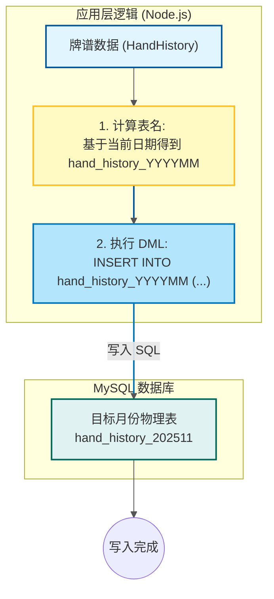

**查询数据流程**

1. 携带时间查询

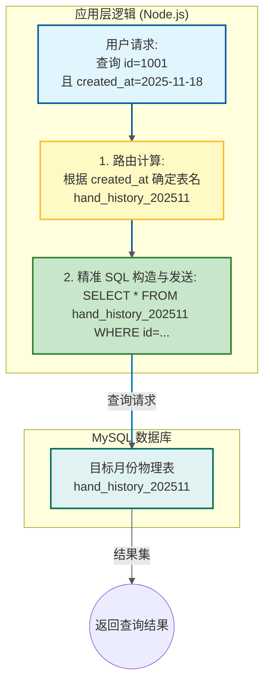

2. 不携带时间查询

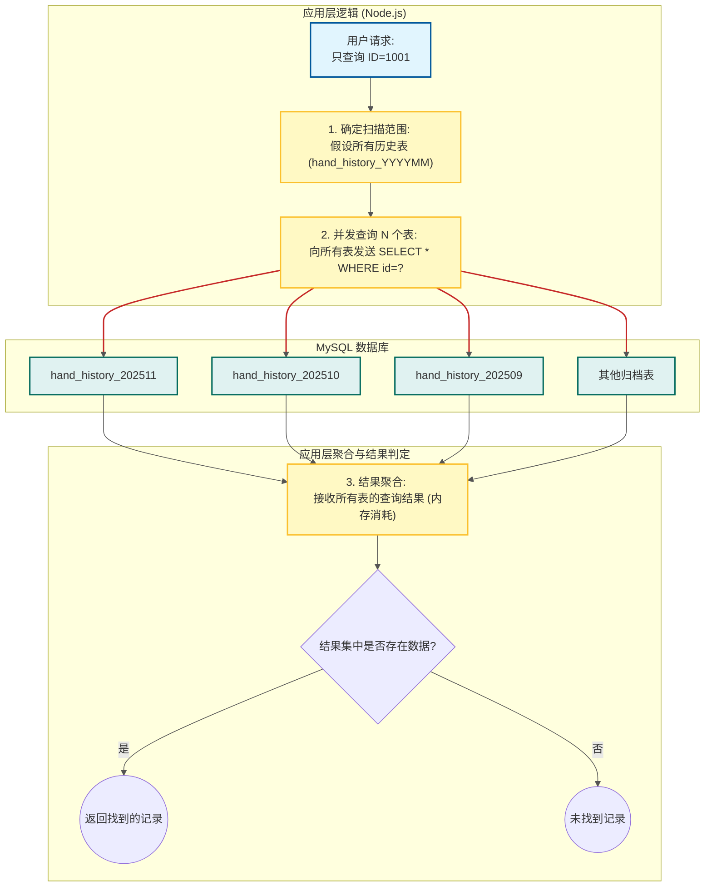

3. 跨分区分页查询

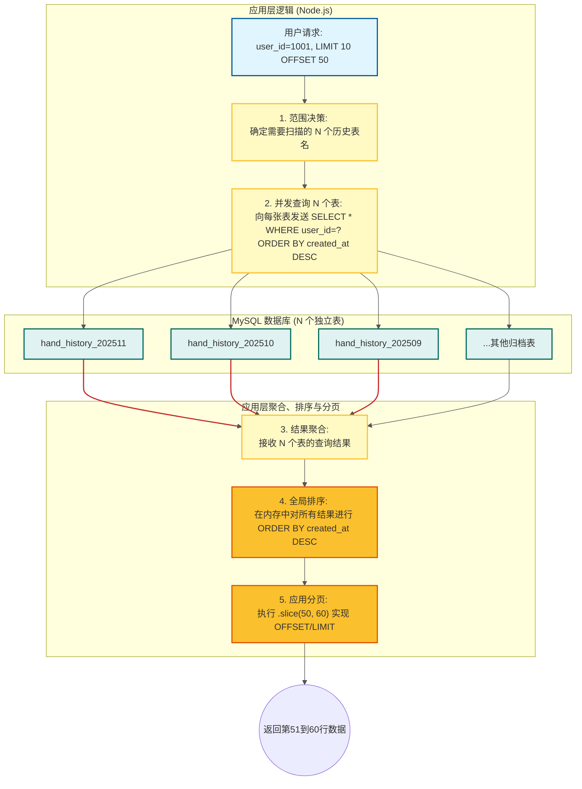

**定时维护分区方案**

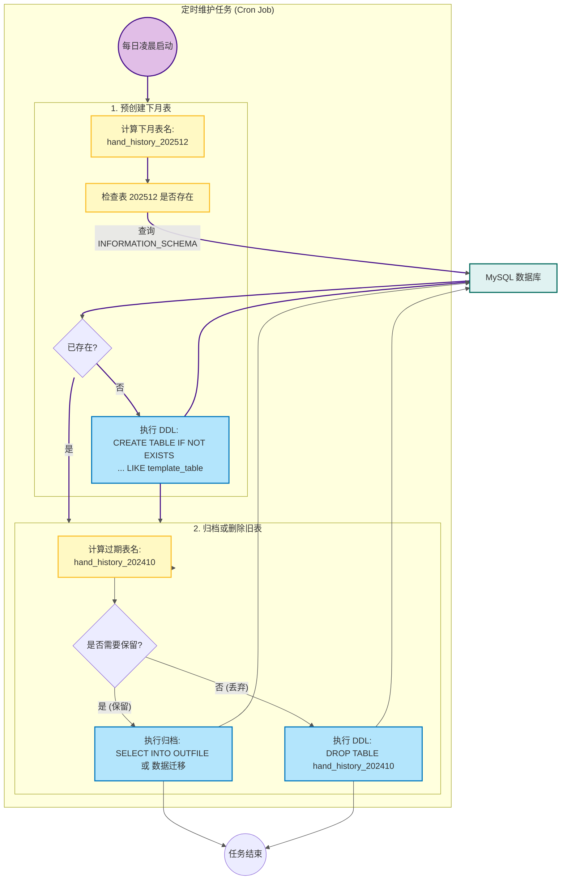

###### 伪代码示例

- Mysql 表 schema

参考 [**应用层分表方案-表结构示例**](#应用层分表方案-表结构示例)

- Node 示例

**保存代码示例**

```ts
// 保存牌谱历史
async function saveHandHistory(handHistory: HandHistory) {
  // 获取表名
  const tableName = getTableName()

  // 保存元数据
  return await mysql[tableName].insert({
    user_id: handHistory.user_id,
    session_id: handHistory.session_id,
    handRecordJson: handHistory.handRecordJson,
  })
}
```

**查询代码示例**

```ts
// 根据ID查询牌谱历史
async function getHandHistory(handHistoryId: string) {
  // 获取当前全部的分表
  const tableNameList = await mysql.query('SHOW TABLES LIKE "hand_history_%"')

  let rows = []
  for (const tableName of tableNameList) {
    const [[row]] = mysql.query(`SELECT * FROM ${tableName} WHERE id = ?`, [handHistoryId])
    rows.push(row)
  }

  const resultList = await Promise.all(rows)
  return resultList.find((row) => row.id === handHistoryId)
}

// 根据用户ID分页查询
async function getHandHistoryByUserIdAndPage(userId: string, page: number, pageSize: number) {
  // 获取当前全部的分表
  const tableNameList = await mysql.query('SHOW TABLES LIKE "hand_history_%"')

  // 查询元数据
  let rows = []
  for (const tableName of tableNameList) {
    const [[row]] = mysql.query(
      `SELECT * FROM ${tableName} WHERE user_id = ? AND created_at BETWEEN ? AND ?`,
      [userId, startTime, endTime]
    )
    rows.push(row)
  }

  const resultList = await Promise.all(rows)
  return resultList
    .sort((a, b) => b.created_at - a.created_at)
    .slice((page - 1) * pageSize, page * pageSize)
}
```

**定时任务代码示例**

```ts
// 定时开辟新分区
async function createNewPartition() {
  // 获取下月的表名
  const tableName = getNextMonthName()

  // 判断表是否已经存在
  const [[row]] = await mysql.query(
    `SELECT * FROM INFORMATION_SCHEMA.TABLES WHERE TABLE_NAME = ?`,
    [tableName]
  )
  if (row) {
    return
  }

  // 创建新表
  await mysql.query(`CREATE TABLE ${tableName} LIKE hand_history_template`)

  // 数据归档
  await archiveAndDeleteOldTable(tableName)
}
```

如果应用层分表涉及到数据归档以后，数据存储的位置不同，需要抽象查询方法出来。

所以这里放到后续的冷热分离方案里详细展开讲。

---

#### 冷热分离方案

这里提到的冷热分离方案，主要是一种渐进式治理数据的思想。

整个流程分为三个阶段： 热表 -> 冷表/热表 -> 冷表/热表/数据归档

冷热分离方案的主要关注点：

- 每个阶段之间如何过渡，如何保证数据的一致性。
- 拆分表以后，如何兼容查询逻辑。主要关注以下几个查询场景：
  - 通过 ID 查询
  - 通过 user_id 分页查询
- 拆分表的时候需要确保全局ID的唯一性，避免ID冲突。

##### 阶段0： 热表

schema 示例：

```sql
CREATE TABLE `hand_history` (
  `id` int unsigned NOT NULL AUTO_INCREMENT,
  `user_id` int unsigned NOT NULL DEFAULT '0',
  `session_id` int unsigned NOT NULL DEFAULT '0',
  `hand_record_json` text NOT NULL,
  `created_at` timestamp NOT NULL DEFAULT CURRENT_TIMESTAMP,
  `updated_at` timestamp NOT NULL DEFAULT CURRENT_TIMESTAMP ON UPDATE CURRENT_TIMESTAMP,
  PRIMARY KEY (`id`),

  KEY `idx_user_id` (`user_id`),
  KEY `idx_session_id` (`session_id`),
  KEY `idx_updated_at` (`updated_at`),
  KEY `idx_created_at` (`created_at`)
)
ENGINE=InnoDB
DEFAULT CHARSET=utf8mb4 COLLATE=utf8mb4_0900_ai_ci
ROW_FORMAT=DYNAMIC;
```

###### 伪代码示例(略)

作为一个单表方案，没有需要特别说明的地方，这里的代码示例就略过了。

##### 阶段1： 冷热表

冷热表拆分的实现方式，是在原有业务表的基础上再新增一个新表。

这张新表既可以作为热表承担主要的读写操作，也可以作为冷表用于数据归档。对比两种不同方式的优缺点：

- 方案A: 新增热表类似于应用层分表的概念，新增的表作为读写的入口，旧表作为后续的归档表。
- 方案B: 新增冷表是业务表的数据迁移到新表，业务表仍做读写操作，新表做归档操作。

**冷热表新表新增方案对比流程图**

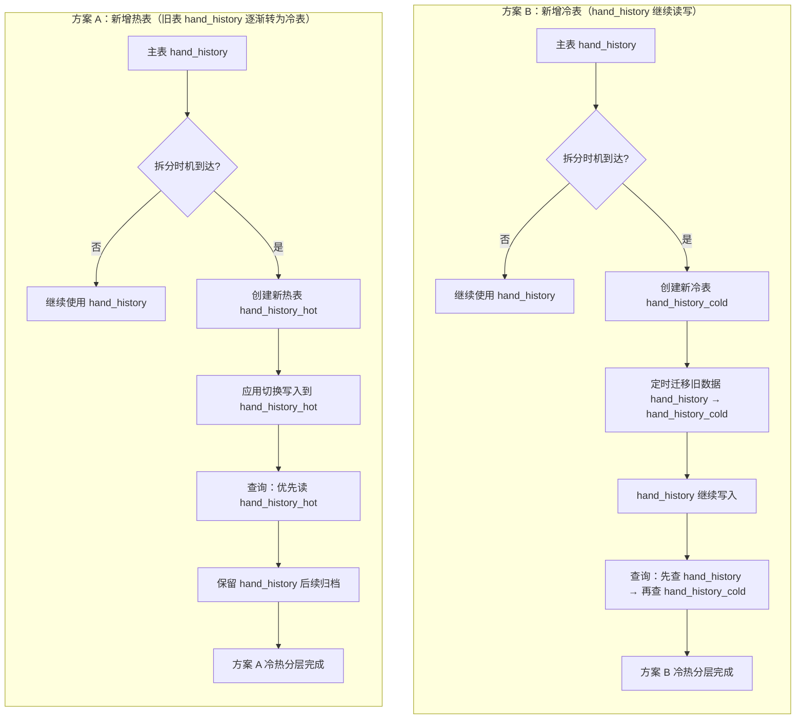

前者类似 [**应用层分表方案**](#应用层分表方案) 的方案，所以主要选择`方案B`的方式进行实践。

确定好拆表方案以后，还需要考虑如何兼容不同的查询场景。这里提出几种方式，针对开篇提到的查询场景做了一个比较：

| 查询场景 \ 方案       | 冷热表（Hot/Warm Table）                             | 新增索引表（Index Table）                                            | 雪花 ID 主键（Snowflake ID PK）                                    |
| --------------------- | ---------------------------------------------------- | -------------------------------------------------------------------- | ------------------------------------------------------------------ |
| 通过 ID 查询          | 必须顺序查询：先查热表 → 失败后查冷表 → 聚合结果。   | 查询索引表（获取数据位置） → 精准查询目标表（热/冷）。               | 解析 ID（提取时间戳）→ 根据时间戳直接路由到目标表 → 单次查询。     |
| 效率 / 开销           | 一般。查询冷表相对较慢。                             | 中高。 多一次索引查询，但达到真正的单次精准查询。                    | 优秀。 应用层即可路由，无需额外查询，效率最高。                    |
| 通过 user_id 分页查询 | 必须扫描热表 + 冷表，由应用层进行 聚合/排序/分页。   | 不适用。 索引表仅记录 ID 位置，无法处理 user_id 维度的跨表范围查询。 | 不适用。 雪花 ID 仅辅助时间路由，无法处理 user_id 维度的跨表查询。 |
| 效率 / 开销           | 极差。 需要跨表全扫描 → 数据量大 → 内存排序开销高 。 | 退化成冷热表方案                                                     | 退化成冷热表方案                                                   |

虽然`索引表`和`雪花ID`都可以在冷热表中优化一些查询，但是针对`user_id`分页查询，仍需要跨表查询。

所以后续的示例，仍会从冷热表方案出发，展示一个最基础的方案。

`顺便插一嘴，考虑到全局ID的唯一性的问题，这里推荐使用雪花ID 替代自增ID。`

**伪代码示例**

1. 新增冷表

冷表的 `hand_record_json` 字段可以改成压缩字段，进一步减少存储空间。

```sql
CREATE TABLE `hand_history_cold` (
  `id` int unsigned NOT NULL DEFAULT '0',
  `user_id` int unsigned NOT NULL DEFAULT '0',
  `session_id` int unsigned NOT NULL DEFAULT '0',
  `hand_record_json` mediumblob NOT NULL,
  `created_at` timestamp NOT NULL DEFAULT CURRENT_TIMESTAMP,
  `updated_at` timestamp NOT NULL DEFAULT CURRENT_TIMESTAMP ON UPDATE CURRENT_TIMESTAMP,
  PRIMARY KEY (`id`),
  KEY `idx_user_id` (`user_id`),
  KEY `idx_session_id` (`session_id`),
  KEY `idx_updated_at` (`updated_at`)
)
ENGINE=InnoDB
DEFAULT CHARSET=utf8mb4 COLLATE=utf8mb4_0900_ai_ci
ROW_FORMAT=DYNAMIC
```

2. 新增定时任务，定期将热表数据迁移到冷表。

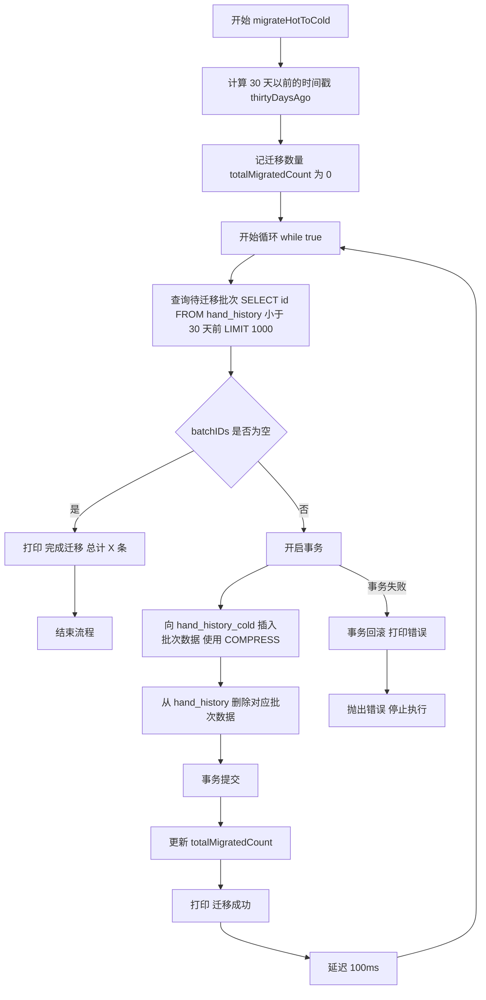

```ts
// 定时迁移热表数据到冷表
async function migrateHotToCold() {
  // 获取 30 天以前的时间戳
  const thirtyDaysAgo = dayjs().subtract(30, 'day').format('YYYY-MM-DD HH:mm:ss')
  let totalMigratedCount = 0

  // 循环执行批处理，直到没有数据可迁移
  const batchSize = 1000 // 每次迁移 1000 条数据
  while (true) {
    // 1. 确定要迁移的批次 (SELECT ID LIMIT)
    // 锁定要迁移的记录的主键 ID 列表
    const rowsToMigrate = await mysql.query(
      'SELECT id FROM hand_history WHERE created_at < ? ORDER BY created_at ASC LIMIT ?',
      [thirtyDaysAgo, batchSize]
    )
    const batchIDs = rowsToMigrate.map((row) => row.id)

    if (batchIDs.length === 0) {
      console.log(`[Migrate] 完成迁移，总计迁移记录: ${totalMigratedCount} 条。`)
      break // 没有更多数据需要迁移，退出循环
    }

    try {
      // 2. 开启事务 (保证 INSERT 和 DELETE 的原子性)
      await mysql.transaction(async (trx) => {
        // 3. 原子性 INSERT (插入冷表，使用 COMPRESS() 且限定 ID)
        // 必须包含原始 ID，且 COMPRESS 操作在 DB 内部完成
        await trx.query(
          `INSERT INTO hand_history_cold (id, user_id, session_id, hand_record_json, created_at, updated_at)
                     SELECT id, user_id, session_id, COMPRESS(hand_record_json), created_at, updated_at
                     FROM hand_history
                     WHERE id IN (?)`,
          [batchIDs]
        )

        // 4. 原子性 DELETE (删除热表，限定 ID)
        // 删除与插入到冷表的完全相同的记录
        await trx.query('DELETE FROM hand_history WHERE id IN (?)', [batchIDs])

        // 事务在此处自动提交
      })

      totalMigratedCount += batchIDs.length
      console.log(`[Migrate] 成功迁移批次 ${batchIDs.length} 条，累计: ${totalMigratedCount}`)
    } catch (error) {
      // 事务失败，自动回滚，保证数据不会丢失
      console.error(`[Migrate Error] 批次迁移失败，事务回滚。错误信息:`, error)
      // 考虑在此处添加告警逻辑

      // 失败后立即退出，防止连续的错误
      throw error
    }

    // 避免查询和写入过于频繁，可以添加短暂的延时（例如 100ms）
    await new Promise((resolve) => setTimeout(resolve, 100))
  }
}
```

注：在应用层通过定时任务迁移数据需要考虑以下问题：

- 如何保证数据一致性。
- 数据量过大的情况，如何保证不阻塞业务。
  - 内存占用过大
  - binlog 日志过大

3. 修改查询逻辑

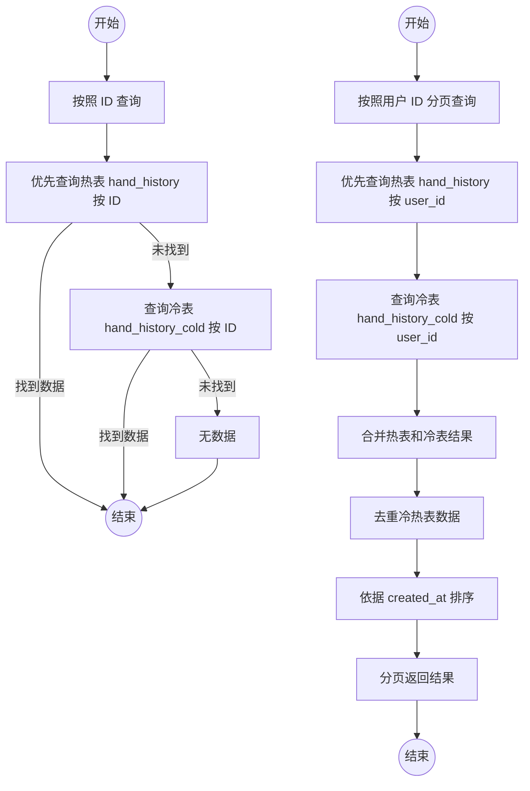

```ts
// 根据ID查询牌谱历史
async function getHandHistoryById(handHistoryId: string) {
  // 查询热表数据
  const hotRow = await mysql.query('SELECT * FROM hand_history WHERE id = ?', [handHistoryId])
  if (hotRow) {
    return hotRow
  }

  // 查询冷表数据
  const coldRow = await mysql.query('SELECT * FROM hand_history_cold WHERE id = ?', [handHistoryId])
  if (coldRow) {
    return coldRow
  }

  return null
}

// 根据用户ID分页查询
async function getHandHistoryByUserIdAndPage(userId: string, page: number, pageSize: number) {
  let rows = []
  // 查询热表数据
  const hotRows = await mysql.query('SELECT * FROM hand_history WHERE user_id = ?', [userId])
  if (hotRows.length > 0) {
    rows = hotRows
  }

  // 查询冷表数据
  const coldRows = await mysql.query('SELECT * FROM hand_history_cold WHERE user_id = ?', [userId])
  if (coldRows.length > 0) {
    rows = [...rows, ...coldRows]
  }

  /**
   * 如果在数据迁移的过程中，并发读取可能会导致数据不一致。
   * 这里数据去重进行兜底
   */
  let map = new Map()
  for (const row of rows) {
    if (!map.has(row.id)) {
      map.set(row.id, row)
    }
  }
  rows = [...map.values()]

  // 排序 分页
  const sortedRows = rows
    .sort((a, b) => b.created_at - a.created_at)
    .slice((page - 1) * pageSize, page * pageSize)

  return sortedRows
}
```

##### 阶段2： 冷表归档

冷表归档的方案大概有三种：

- Mysql 存放。
- 本地磁盘存放。
- 对象存储存放。

归档流程图示意：

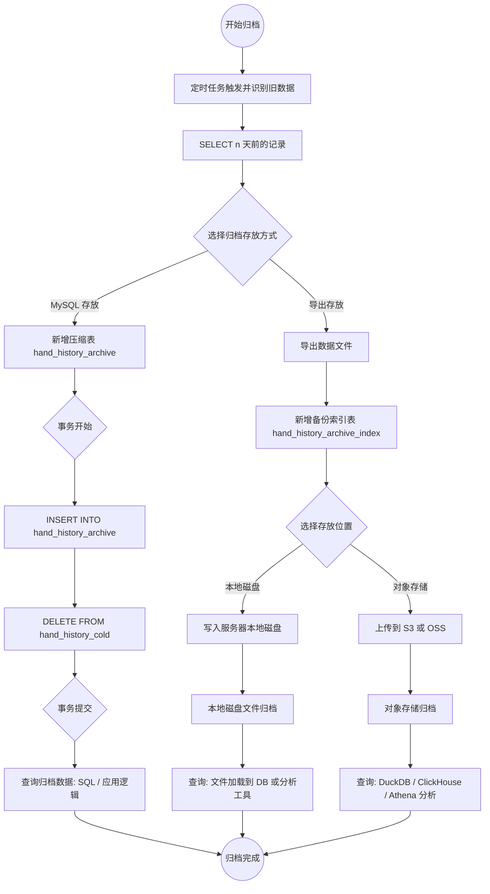

对比三种存放方式的优缺点：

| 属性                | MySQL 存放                                     | 本地磁盘                                    | 对象存储                                                                                                        |
| ------------------- | ---------------------------------------------- | ------------------------------------------- | --------------------------------------------------------------------------------------------------------------- |
| 流程概述            | 新增压缩表 → 插入归档表 → 删除冷表数据         | 导出数据 → 写入服务器本地磁盘               | 导出数据 → 上传到 S3/OSS → 重构查询逻辑                                                                         |
| 查询方式            | SQL / 应用逻辑                                 | 文件加载到 DB 或分析工具                    | DuckDB / ClickHouse / Athena 分析                                                                               |
| 优势                | 数据管理方便，数据一致性高                     | 实现简单，速度快                            | 弹性存储，成本低，容量几乎无限                                                                                  |
| 注意事项 / 潜在问题 | 占用数据库资源，读写性能下降；事务需保证原子性 | 多机部署时文件同步困难；备份/恢复需额外处理 | 文件格式选择（SQL/JSON/CSV/Parquet）；存储分层策略（按时间/用户/Session）；查询逻辑复杂；数据一致性保障需要设计 |

考虑到 Mysql 方案是依赖于压缩表难点不多，而本地存储方案难点大多与对象存储类似，所以这里针对对象存储方案进行详细说明。

对象存储相关痛点包括：文件类型选择、目录结构选择、查询逻辑重构。

- **Mysql 数据导出的文件类型选择**

导出数据的文件类型对比：

| 格式类型     | 优点                                                                               | 缺点                                                    | 适用场景                                             |
| ------------ | ---------------------------------------------------------------------------------- | ------------------------------------------------------- | ---------------------------------------------------- |
| **SQL Dump** | - 可恢复表结构和数据<br>- 官方工具支持<br>- 整库迁移方便                           | - 体积巨大<br>- 不适合长期存储<br>- 查询性能差          | 备份、迁移、灾难恢复（需要恢复 MySQL）               |
| **CSV**      | - 轻量、跨平台<br>- 支持各种分析工具<br>- 无语言依赖                               | - 无 schema<br>- 不支持复杂结构<br>- 数值/空值容易出错  | 简单表格数据导出、第三方系统导入                     |
| **JSON**     | - 支持复杂嵌套结构<br>- 可读性强<br>- 跨系统兼容                                   | - 体积大<br>- 查询性能差<br>- 不适合超大规模归档        | 日志类数据、结构复杂字段（如 hand_record_json）      |
| **Parquet**  | - 列式存储压缩率高（10x）<br>- 查询快（按列读取）<br>- 适合大数据<br>- S3 成本极低 | - MySQL 无法直接读取<br>- 需 Athena/Spark/DuckDB 等工具 | **长期归档、数据湖、分析查询、冷数据存储（最推荐）** |

对比多种类型，Parquet 文件类型可能是更适用的选择。

在实操过程中，可以通过 `SELECT` 查出数据，然后通过 stream 的方式分批写入到 Parquet 文件中。

- **存储到对象存储的目录结构选择**

考虑到我们是按照时间归档的数据，所以可以按照时间的维度，组织目录结构存储到对象存储。
例如： `2025/01/01/data.parquet`、`2025/01/02/data.parquet` 等。

- **查询逻辑重构的思路**

可以考虑新增一个索引表，归档的时候记录文件的元信息，如：日期、文件存储的地址等。

后续查询涉及到归档数据的时候，可以通过索引表确定文件位置。

然后通过 Parquet 的原生支持，或者类似 DuckDB 的中间件进行查询。

**伪代码示例**

1. 新增索引表

```sql
CREATE TABLE `hand_history_archive` (
  `id` int unsigned NOT NULL AUTO_INCREMENT,
  `date` date NOT NULL,
  -- 记录备份阶段，用于备份失败或者中断后继续备份。
  `stage` TINYINT UNSIGNED NOT NULL DEFAULT 0 COMMENT '备份阶段：0=未开始,1=已上传至对象存储,2=备份完成',
  `bucket_name` varchar(255) NOT NULL COMMENT '对象存储桶名',
  `object_key` varchar(255) NOT NULL COMMENT '对象存储键名',
  `created_at` timestamp NOT NULL DEFAULT CURRENT_TIMESTAMP,
  `updated_at` timestamp NOT NULL DEFAULT CURRENT_TIMESTAMP ON UPDATE CURRENT_TIMESTAMP,
  PRIMARY KEY (`id`),
  UNIQUE KEY `uniq_date` (`date`),
  KEY `idx_updated_at` (`updated_at`)
)
ENGINE=InnoDB
DEFAULT CHARSET=utf8mb4 COLLATE=utf8mb4_0900_ai_ci
ROW_FORMAT=DYNAMIC;
```

2. 新增定时任务，定期将冷表数据导出到对象存储。

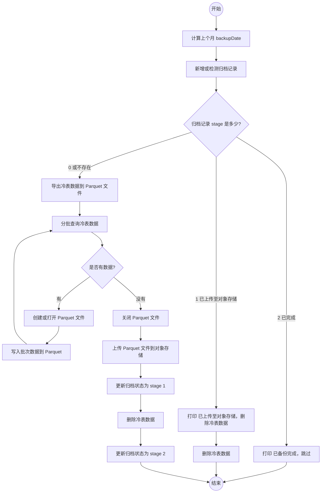

```ts
// 定时任务代码示例
async function exportColdDataToObjectStorage() {
  // 新增或检测是否存在归档记录
  const backupDate = dayjs().subtract(1, 'month').format('YYYY/MM') // 上个月
  const backupRecord = await upsertArchiveRecord(backupDate)
  if (backupRecord.stage === 2) {
    console.log(`[Export] ${backupDate} 已备份完成，跳过`)
    return
  }

  // 如果备份阶段是1，已经上传至对象存储，则需要删除冷表数据并更新归档状态
  if (backupRecord.stage === 1) {
    console.log(`[Export] ${backupDate} 已上传至对象存储，删除冷表数据`)
    await deleteColdData(backupDate)
    await updateArchiveRecord(backupDate, 2)
    return
  }

  // 1. 将需要导出的数据转为 Parquet 文件
  const parquetFilepath = await exportColdDataToParquetFile(backupDate)

  // 2. 将 Parquet 文件上传到对象存储
  let config = getConfig()
  const key = `hand_history_backup/${backupDate}/${parquetFilepath}`
  await uploadParquetFile(config.bucketName, key, parquetFilepath)

  // 更新归档状态
  await updateArchiveRecord(backupDate, 1)

  // 3. 删除冷表数据，并标记归档成功
  await deleteColdData(backupDate)

  // 更新归档状态
  await updateArchiveRecord(backupDate, 2)
}

// 新增或检测是否存在归档记录
async function upsertArchiveRecord(backupDate: string) {
  // 将 'YYYY/MM' 格式转换为 'YYYY-MM-01' 格式以匹配 date 字段
  const dateStr = backupDate.replace('/', '-') + '-01'
  // upsert
  await mysql.query(
    'INSERT INTO hand_history_archive (date) VALUES (?) on duplicate key update updated_at = CURRENT_TIMESTAMP',
    [dateStr]
  )

  // 获取归档记录
  const [record] = await mysql.query('SELECT * FROM hand_history_archive WHERE date = ? limit 1', [
    dateStr,
  ])

  return record
}

// 将需要导出的数据转为 Parquet 文件
async function exportColdDataToParquetFile(backupDate: string) {
  // 分批查询数据并写入到 Parquet 文件
  const batchSize = 1000 // 每次导出 1000 条数据
  // 指定上个月的起始时间和截至时间
  // 注意：backupDate 格式为 'YYYY/MM'，需要转换为完整的日期字符串才能正确解析
  const dateStr = backupDate.replace('/', '-') + '-01'
  const startTime = dayjs(dateStr).startOf('month').valueOf()
  const endTime = dayjs(dateStr).endOf('month').valueOf()

  // 指定文件路径
  let writer = null // stream writer
  let parquetFilepath = '' // 文件路径
  try {
    while (true) {
      // 1. 确定要导出的批次 (SELECT ID LIMIT)
      const rows = await mysql.query(
        'SELECT * FROM hand_history_cold WHERE created_at BETWEEN ? AND ? ORDER BY id ASC LIMIT ?',
        [startTime, endTime, batchSize]
      )
      if (rows.length === 0) {
        break
      }

      if (!parquetFilepath) {
        parquetFilepath = dayjs().subtract(1, 'month').format('YYYY_MM') + '.backup.parquet'
      }

      // 2. 确定文件是否存在，不存在则创建
      if (!writer) {
        //  这里需要定义 schema 、确定文件是否存在，详情不做展开
        writer = await parquet.ParquetWriter.openFile(schema, parquetFilepath)
      }

      // 3. 将数据写入到 Parquet 文件
      for (const row of rows) {
        await writer.appendRow(row)
      }
    }
  } catch (error) {
    console.error('导出数据失败', error)
    throw error
  } finally {
    if (writer) {
      await writer.close()
    }
  }

  return parquetFilepath
}

// 上传 Parquet 文件到对象存储
async function uploadParquetFile(bucketName: string, objectKey: string, filepath: string) {
  const s3 = await getS3Client()

  const fileBuffer = fs.readFileSync(filepath)
  await s3.putObject({
    Bucket: bucketName,
    Key: objectKey,
    Body: fileBuffer,
  })

  // 删除本地文件
  fs.unlinkSync(filepath)

  return objectKey
}

// 删除冷表数据
async function deleteColdData(backupDate: string) {
  // 注意：backupDate 格式为 'YYYY/MM'，需要转换为完整的日期字符串才能正确解析
  const dateStr = backupDate.replace('/', '-') + '-01'
  let startTime = dayjs(dateStr).startOf('month').valueOf()
  let endTime = dayjs(dateStr).endOf('month').valueOf()

  await mysql.query('DELETE FROM hand_history_cold WHERE created_at BETWEEN ? AND ?', [
    startTime,
    endTime,
  ])
}

// 更新归档状态
async function updateArchiveRecord(backupDate: string, stage: number) {
  // 将 'YYYY/MM' 格式转换为 'YYYY-MM-01' 格式以匹配 date 字段
  const dateStr = backupDate.replace('/', '-') + '-01'
  await mysql.query('UPDATE hand_history_archive SET stage = ? WHERE date = ?', [stage, dateStr])
}
```

注： 在阶段1 -> 阶段2 之间，删除冷表数据还没更新归档状态的时候，如果产生查询或者崩溃，可能会导致查询的数据不完整。

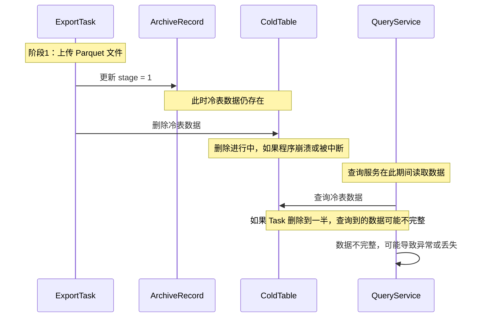

可以用两种方法解决这个问题：把删除冷表数据和更新归档记录放在一个事务里，或者给冷表增加归档状态字段，先标记数据，后续再删除，而不是立即删除。

3. 查询数据方案

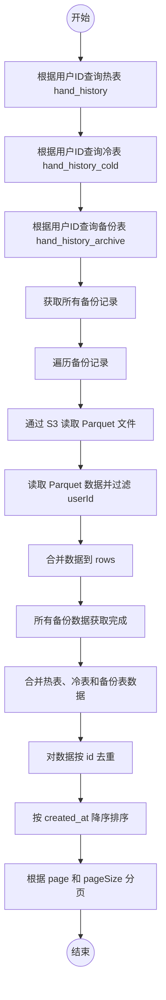

```ts
// 根据用户ID分页查询
async function getHandHistoryByUserIdAndPage(userId: string, page: number, pageSize: number) {
  // 查询热表数据
  const hotRows = await mysql.query('SELECT * FROM hand_history WHERE user_id = ?', [userId])

  // 查询冷表数据
  const coldRows = await mysql.query('SELECT * FROM hand_history_cold WHERE user_id = ?', [userId])

  // 查询备份表数据
  const archiveRows = await getArchiveRowsByUserId(userId)

  // 合并数据
  const rows = [...hotRows, ...coldRows, ...archiveRows]

  // 兜底去重
  let map = new Map()
  for (const row of rows) {
    if (!map.has(row.id)) {
      map.set(row.id, row)
    }
  }
  rows = [...map.values()]

  // 排序 分页
  const sortedRows = rows
    .sort((a, b) => b.created_at - a.created_at)
    .slice((page - 1) * pageSize, page * pageSize)

  return sortedRows
}

// 根据用户ID查询备份表数据
async function getArchiveRowsByUserId(userId: string) {
  // 获取所有的备份记录
  const archiveRecords = await mysql.query('SELECT * FROM hand_history_archive')

  // 根据备份记录获取数据
  const rows = await getParquetRowsByArchiveRecords(archiveRecords, { userId })

  return rows
}

// 根据备份记录获取数据
async function getParquetRowsByArchiveRecords(archiveRecords: any[], params: any) {
  let rows = []

  for (const record of archiveRecords) {
    // 通过 s3 读取 parquet 文件
    const parquetFilepath = await readParquetFileByS3(record)

    // 通过 parquet 读取数据
    const data = await readParquetData(parquetFilepath, params)

    // 合并数据
    rows = [...rows, ...data]
  }

  return rows
}

// 通过 s3 读取 parquet 文件
async function readParquetFileByS3(record: any) {
  // 获取 s3 客户端
  const s3 = await getS3Client()

  // 读取 parquet 文件
  const response = await s3.getObject({
    Bucket: record.bucket_name,
    Key: record.object_key,
  })

  // 写入本地
  const body = await response.Body!.transformToByteArray()
  const localFile = 'tmp_' + record.object_key
  fs.writeFileSync(localFile, body)

  return localFile
}

async function readParquetData(localFile: string, params: any) {
  // 读取本地文件
  const reader = await parquet.ParquetReader.openFile(localFile)

  // 获取游标
  let result = [] as any[]
  const cursor = await reader.getCursor(params)
  try {
    let record: any = null
    while ((record = await cursor.next())) {
      // 过滤数据
      if (params.userId && record.user_id !== params.userId) {
        continue
      }
      result.push(record)
    }
  } catch (error) {
    console.error('读取数据失败', error)
    throw error
  } finally {
    // 关闭文件
    await reader.close()
  }

  // 返回数据
  return result
}
```

#### 按用户拆表

按用户分表大概需要考虑以下问题：

- 分表策略和粒度
- 多维度查询问题
- 归档扩容问题

##### 分表策略和粒度

分表策略可以按照 `user_id` 拆分，也可以按照`用户类型`拆分。结合业务场景的特性，可能一些付费用户产生的数据量更大，但是这个不好量化，所以这里先按照 `user_id` 拆分。

一般采用的分表算法是 `user_id % N`，N 是分表的数量。

N 的估算公式如下：

`N = ceil( 每日条数 × 30天 × 保留月份 ÷ 单表最大容量 )`

代入我们之前的数据信息：10w 条每天，一月单表 300w 数据。

| 保留月份 | 每日写入量 | 单表容量 | 总数据量 | 需要表数 N（向上取整） |
| -------: | ---------: | -------: | -------: | ---------------------: |
|   6 个月 |        10w |     300w |    1800w |                  **6** |
|  12 个月 |        10w |     300w |    3600w |                 **12** |
|  24 个月 |        10w |     300w |    7200w |                 **24** |
|  36 个月 |        10w |     300w |   10800w |                 **36** |

基于当前的数据量，我们大概可以知道，想要保留几个月的热点数据，就可以分几张表。

N 的具体取值，考虑到均匀性，质数可能是一个更好的选择。不过我们的 user_id 是自增ID，均匀性问题不大。考虑到扩展性，可以按照 2 的幂次方来分表。

##### 多维度查询问题

| 查询维度               | 处理方式              | 说明                                                      |
| ---------------------- | --------------------- | --------------------------------------------------------- |
| user_id 分页查询       | 天然支持              | 不需要额外处理，直接按 user_id 查询热表/冷表即可          |
| 牌局ID                 | 引入牌局ID索引表      | 索引表记录牌局ID对应的表名，查询先查索引表再定位数据      |
| sessionID              | 引入 sessionID 索引表 | 索引表记录 sessionID 对应的表名，查询先查索引表再定位数据 |
| 其他字段（如时间范围） | 全表扫描              | 无索引支持，需要扫描热表/冷表                             |

##### 归档扩容问题

| 方案 | 方法说明                     | 优点                         | 缺点 / 注意点                          |
| ---- | ---------------------------- | ---------------------------- | -------------------------------------- |
| 扩容 | 增加表数量 N                 | 简单直接，按现有逻辑扩展     | 后续可能需要分库，增加业务复杂度       |
| 分库 | 将数据表拆分到多个数据库实例 | 可进一步扩展 IO / CPU 资源   | 增加运维和业务复杂度                   |
| 归档 | 引入对象存储（如 S3）        | 节省数据库空间，降低热表压力 | 查询归档数据需要额外成本，访问延迟较高 |

###### 伪代码示例

考量按用户分表，技术难点与之前提到的分表方案大同小异，这里不再赘述。

`该方案不展开讲的原因，就是个人感觉这个方案最初就会把业务搞复杂，在没有特定场景和需求的时候，引入这种方案可能会适得其反。`

## 方案总结

对比文中的各种方案，不难发现每个方案都有自己的优缺点，没有绝对完美的方案。

因此我推荐采用一些渐进式治理数据的思想，结合业务场景，逐步优化数据存储。

对于我们觉得可能产生大数据的表，可以做一些防御性设计。如：

1. 通过雪花ID代替自增ID，保证全局ID的唯一性。
2. 通过二进制压缩字段，减少存储空间。
